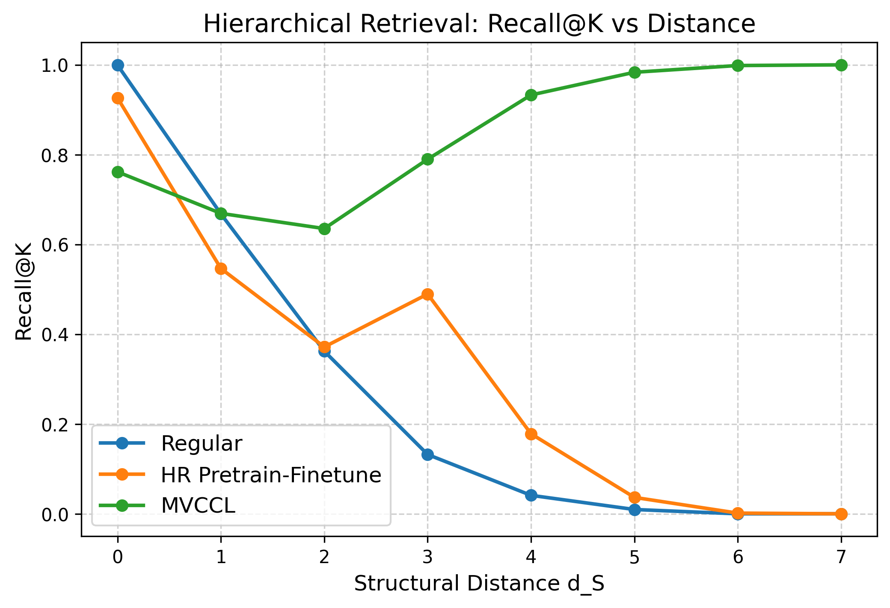

# MVCCL_V3 for Hierarchical Retrieval

This version is to overcome:
1. short-distance forgetting (catastrophic forgetting of d=0,1 relations),
2. imbalanced training signals (too many long-distance positives),
3. over-aggressive hard negatives that push apart nodes that should remain close.

To address these problems, this branch implements a multi-stage curriculum learning framework equipped with structured positive reinforcement and hierarchical ranking constraints.

## 1. Methodology

### 1.1 Multi-View Curriculum Learning
#### Stage 1- Easy View: Random Negatives
Negatives are randomly sampled from the entire vocabulary,
except for nodes that are structurally too close:

$$
d_S(q, x) \leq 1 \quad \Rightarrow \quad x \text{ cannot be a negative.}
$$

This stage provides stable initial geometry, preventing the model from collapsing.

#### Stage 2- Medium View: Sibling Negatives
Negatives are selected from siblings under the same parent:

$$
x \in \text{siblings}(q), \quad d_S(q, x) \ge 2.
$$

Siblings are semantically related but structurally distinct,
making them effective mid-difficulty negatives.
If insufficient siblings exist, we fall back to filtered easy negatives.

This stage encourages the model to disambiguate fine-grained local structure.


#### Stage 3- Hard View: Semantic Nearest Neighbors 

Using the SBERT embedding space, we identify the top-K most semantically similar nodes:

$$
x \in \text{TopK}_\text{semantic}(q), \quad d_S(q, x) \ge 2.
$$


These nodes are often highly confusable.
Hard negatives force the model to encode structure over raw semantics.

Hard-stage replay (Anti-forgetting)
To avoid catastrophic forgetting of early structural information:
* each batch has 10% replay from the easy stage,
* helping the model retain short-distance constraints.

Temperature scheduling
Hard negatives use a slightly higher contrastive temperature (0.10)
to avoid over-penalizing extremely similar semantic nodes.


### 1.2 Structure-Aware Positive Reinforcement
Hierarchical data is highly imbalanced:
* near positives (d=0,1) are rare
* mid/long positives dominate the positive pool

To counter this imbalance, MVCCL applies distance-aware positive weighting:

$$
w(d) =
\begin{cases}
3.0, & d=0 \\
2.0, & d=1 \\
1.0, & d\ge 2.
\end{cases}
$$

The weighted loss is:

$$
L_{\text{pos}} = \frac{1}{B} \sum_{i=1}^B w(d_i) \cdot L_i.
$$

This ensures the model continuously maintains local structural fidelity during training.

### 1.3 Hierachical Ranking Loss
Contrastive learning alone cannot guarantee: **parent should be closer than grandparent.**

Thus, MVCCL v3 introduces a hierarchical ranking constraint:

For each query q:
* sample a near positive $p_{\text{near}}$ with $d_S \le 1$
* sample a mid positive $p_{\text{mid}}$ with $2 \le d_S \le 3$

We enforce:

$$
\text{sim}(q, p_{\text{near}}) > \text{sim}(q, p_{\text{mid}}) + \text{margin}.
$$

The ranking loss is:

$$
L_{\text{rank}} =
\max(0,\;
m - (\text{sim}(q,p_{\text{near}}) - \text{sim}(q,p_{\text{mid}})))
$$

with margin m = 0.2.

This loss explicitly promotes:
* monotonic decay of similarity with structural distance,
* resolving the common issue where long-distance recall is high but short-distance recall is poor.

### 1.5 Loss Function


In each stage, the total loss is:

$$
L = L_{\text{contrastive}}^{(\text{easy/med/hard})} + L_{\text{pos-weighted}} + \lambda_{\text{rank}} L_{\text{rank}}
$$

where $L_{\text{contrastive}}$ = InfoNCE with explicit negatives, $L_{\text{pos-weighted}}$ = short-distance reinforcement,	$L_{\text{rank}}$ = hierarchical ordering enforcement, $\lambda_{\text{rank}}$ = 1.0.


## Quick Start & Result
```bash
# By default, the WordNet subtree is constructed with "animal.n.01" as the root.
python main.py
```
After running, it will print the Recall@K values for each distance and generate a comparison curve.`recall_by_distance.png`

Current Result:
| **Structural Distance** | **MVCCL** | **HR Pretrain-Finetune** | **Regular** |
|---------------------------------|-----------|--------------------------|-------------|
| 0                       | 76.16%    | 92.61%                   | 99.94%    |
| 1                      | 66.91%   | 54.63%                   | 66.79%      |
| 2                       | 63.53%    | 37.17%                   | 36.22%      |
| 3                       | 78.98%    | 48.95%                   | 13.21%      |
| 4                       | 93.29%   | 17.82%                   | 4.11%      |
| 5                       | 98.35%    | 3.66%                   | 0.96%       |
| 6                        | 99.85%    | 0.15%                    | 0.00%       |
| 7                      | 100.00%    | 0.00%                   | 0.00%       |
| OVERALL                | 79.84%    | 41.79%                  | 36.92%      |

